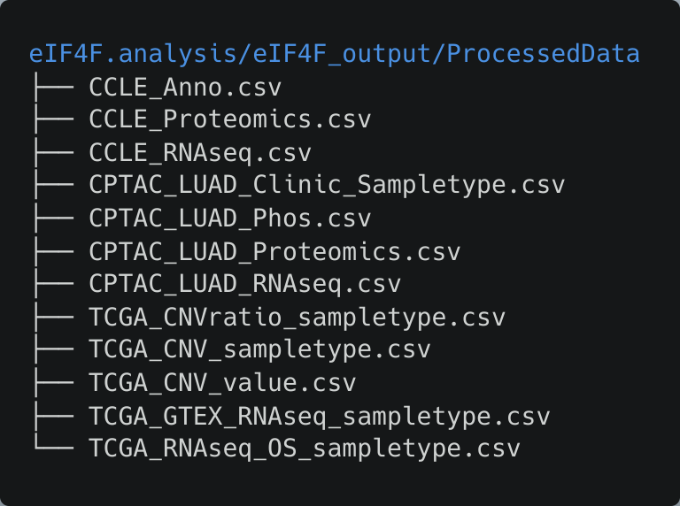
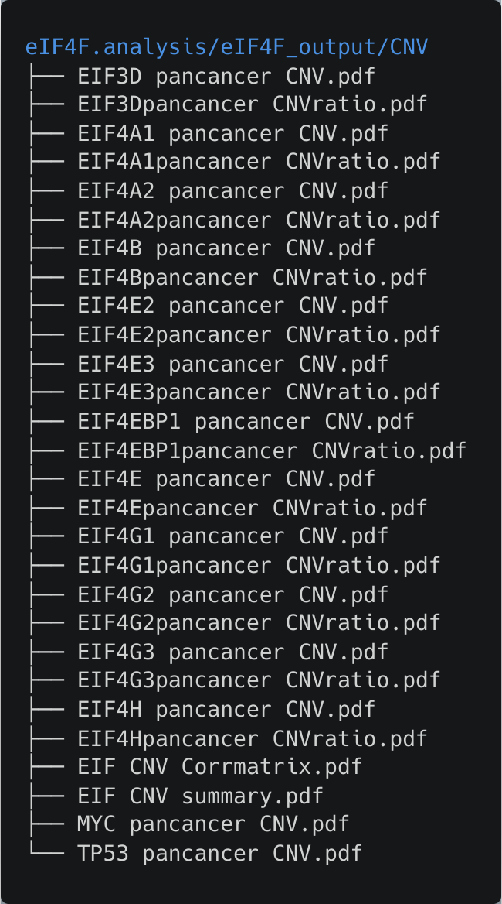
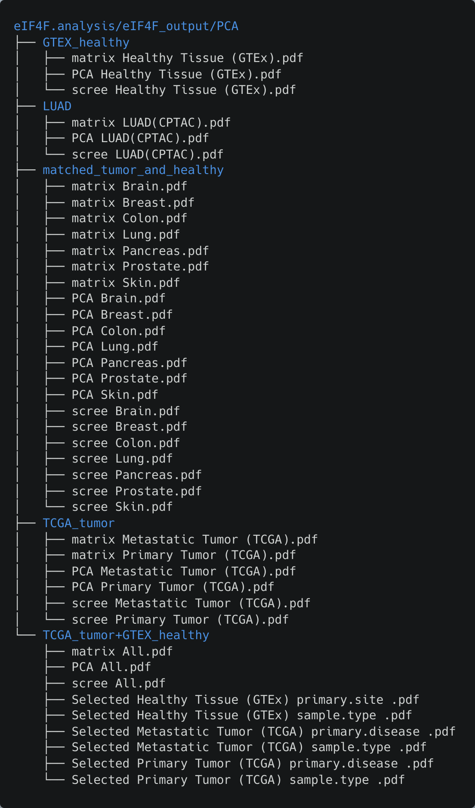
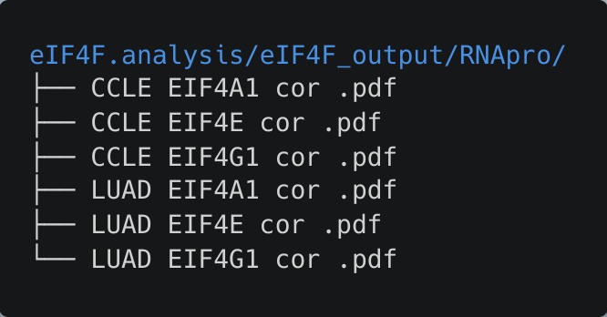
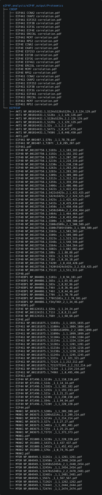

```{r, include = FALSE}
knitr::opts_chunk$set(
  collapse = TRUE,
  comment = "#>"
)
```

## Library installation

Load eIF4F.analysis library.

```{r, eval = FALSE}
# install eIF4F.analysis package 
devtools::install_github("a3609640/eIF4F.analysis")
# load eif4F.analysis	
library(eIF4F.analysis)
```

## Library initialization

### Create output directories

Run the `initialize_dir()` command to create the sub-directories under `~/Documents/EIF_output` to store the output files.

```{r, eval = FALSE}
initialize_dir()
```

### Define font format

Load the font types, size and orientation for plotting functions.

```{r, eval = FALSE}
initialize_format()
```

### Load omics datasets

Load all needed TCGA, GTEX, CPTAC and CCLE datasets download by `Download.sh` for the following analyses.

```{r, eval = FALSE}
initialize_data()
```

12 global variables will be saved at csv files under `~/eIF4F.analysis/eIF4F_output/ProcessedData`

{width="384"}

## Perform CNV analysis

```{r, eval = FALSE}
EIF4F_CNV_analysis()
```

Results will be saved as following

{width="335"}

## Perform differential gene expression/ratio analysis

```{r, eval = FALSE}
EIF4F_DEG_analysis()
```

{width="342"}

## Perform gene expression and survival analysis

```{r, eval = FALSE}
EIF4F_Survival_analysis()
```

{width="537"}

## Perform PCA

```{r, eval = FALSE}
EIF4F_PCA()
```

{width="552"}

## Perform correlating gene analysis

```{r, eval = FALSE}
EIF4F_Corrgene_analysis()
```

{width="367"}

## Perform RNA protein expression correlation analysis

```{r, eval = FALSE}
EIF4F_RNA_pro_correlation()
```

{width="333"}

## Perform (phospho)proteomics analysis

```{r, eval = FALSE}
EIF4F_Proteomics_analysis()
```

{width="544"}
